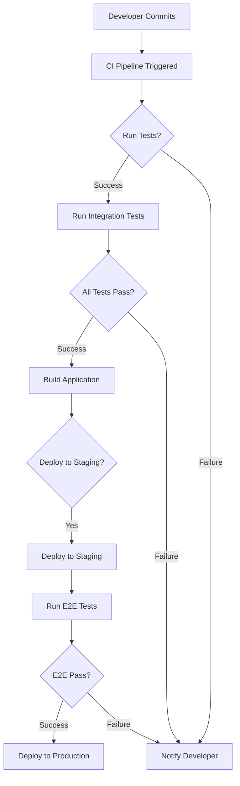

# CI/CD Integration for Tests in Node.js: A Complete Journey from First Principles

Let me take you on a comprehensive journey through CI/CD integration for Node.js tests, starting from the absolute fundamentals and building up to advanced concepts.

## What is CI/CD? Understanding the Foundation

Before we dive into Node.js specifics, let's understand what CI/CD really means at its core.

**Continuous Integration (CI)** is like having a watchful guardian that constantly checks the health of your codebase. Imagine you're working on a group project with multiple people. Without CI, everyone would work on their own parts and only discover conflicts when trying to merge everything together - often leading to chaos.

> CI is the practice of frequently integrating code changes from multiple developers into a shared repository, automatically testing these changes to catch issues early.

**Continuous Deployment/Delivery (CD)** extends this concept. If CI is about ensuring your code works, CD is about getting that working code to your users safely and reliably.

> CD automates the process of taking tested, validated code and deploying it to production environments, ensuring a smooth and reliable release process.

## Why Do We Need CI/CD for Tests?

Think of testing without CI/CD like manually checking every door and window in a building before locking up each night. It works, but it's:

* Time-consuming
* Error-prone
* Inconsistent
* Not scalable

CI/CD transforms this into having an automated security system that instantly alerts you if anything is wrong.

## The Architecture: How It All Fits Together

Let me paint a picture of how CI/CD works with Node.js tests:

```
Developer → Git Repository → CI Server → Tests → Deployment
    ↓           ↓                ↓          ↓         ↓
  Code       Triggers         Runs       Pass?    Deploy
  Push       Pipeline         Tests     (Y/N)    or Stop
```

Now let's dive deep into each component.

## Setting Up Your Node.js Project for CI/CD

### 1. Project Structure - The Foundation

First, let's create a solid foundation for our Node.js project:

```javascript
// package.json - The blueprint of your project
{
  "name": "nodejs-cicd-example",
  "version": "1.0.0",
  "scripts": {
    "test": "jest",
    "test:coverage": "jest --coverage",
    "test:ci": "jest --ci --coverage --maxWorkers=2",
    "lint": "eslint src/**/*.js",
    "lint:fix": "eslint src/**/*.js --fix"
  },
  "devDependencies": {
    "jest": "^29.0.0",
    "eslint": "^8.0.0"
  }
}
```

**Why these scripts matter:**

* `test:ci`: Optimized for CI environments (limited workers, coverage enabled)
* `lint`: Ensures code quality standards
* `lint:fix`: Automatically fixes style issues

### 2. Writing Testable Code

Let's start with a simple example to understand the principles:

```javascript
// src/calculator.js - A simple function to test
function add(a, b) {
  // Input validation - crucial for robust CI/CD
  if (typeof a !== 'number' || typeof b !== 'number') {
    throw new Error('Both arguments must be numbers');
  }
  return a + b;
}

function multiply(a, b) {
  if (typeof a !== 'number' || typeof b !== 'number') {
    throw new Error('Both arguments must be numbers');
  }
  return a * b;
}

module.exports = { add, multiply };
```

**Key principles in this code:**

1. **Pure functions** : They don't depend on external state
2. **Input validation** : Essential for catching errors early
3. **Clear exports** : Makes testing straightforward

### 3. Writing Comprehensive Tests

Now let's create tests that CI/CD systems can run:

```javascript
// tests/calculator.test.js
const { add, multiply } = require('../src/calculator');

describe('Calculator Functions', () => {
  // Group related tests together
  describe('add function', () => {
    test('should add two positive numbers correctly', () => {
      // Arrange
      const num1 = 5;
      const num2 = 3;
      const expected = 8;
    
      // Act
      const result = add(num1, num2);
    
      // Assert
      expect(result).toBe(expected);
    });
  
    test('should handle negative numbers', () => {
      expect(add(-5, 3)).toBe(-2);
      expect(add(-5, -3)).toBe(-8);
    });
  
    test('should throw error for invalid input', () => {
      expect(() => add('5', 3)).toThrow('Both arguments must be numbers');
      expect(() => add(5, undefined)).toThrow('Both arguments must be numbers');
    });
  });
  
  // Test async operations (important for real applications)
  describe('async operations', () => {
    test('should handle async calculations', async () => {
      const asyncAdd = async (a, b) => {
        return new Promise((resolve) => {
          setTimeout(() => resolve(add(a, b)), 100);
        });
      };
    
      const result = await asyncAdd(5, 3);
      expect(result).toBe(8);
    });
  });
});
```

**Understanding the test structure:**

* **Arrange-Act-Assert pattern** : Makes tests readable and predictable
* **Descriptive names** : CI systems show these in reports
* **Edge case testing** : Crucial for catching bugs in CI

## Implementing CI/CD Pipelines

### 1. GitHub Actions - A Practical Example

Let's create a complete CI/CD pipeline using GitHub Actions:

```yaml
# .github/workflows/nodejs-ci.yml
name: Node.js CI/CD Pipeline

# When should this pipeline run?
on:
  push:
    branches: [ main, develop ]
  pull_request:
    branches: [ main ]

# Define the jobs
jobs:
  test:
    runs-on: ubuntu-latest
  
    # Test on multiple Node.js versions
    strategy:
      matrix:
        node-version: [16.x, 18.x, 20.x]
  
    steps:
    # Step 1: Get the code
    - uses: actions/checkout@v3
  
    # Step 2: Set up Node.js
    - name: Use Node.js ${{ matrix.node-version }}
      uses: actions/setup-node@v3
      with:
        node-version: ${{ matrix.node-version }}
        cache: 'npm'
  
    # Step 3: Install dependencies
    - name: Install dependencies
      run: npm ci
  
    # Step 4: Run linting
    - name: Run linting
      run: npm run lint
  
    # Step 5: Run tests with coverage
    - name: Run tests
      run: npm run test:ci
  
    # Step 6: Upload coverage report
    - name: Upload coverage
      uses: codecov/codecov-action@v3
      if: matrix.node-version == '18.x'
```

**Breaking down this pipeline:**

1. **Triggers** : Defines when the pipeline runs (push to main/develop, PRs)
2. **Matrix strategy** : Tests against multiple Node.js versions
3. **Cache** : Speeds up builds by caching npm dependencies
4. **Sequential steps** : Each step depends on the previous one

### 2. Adding Integration Tests

Let's create more sophisticated tests for a real-world scenario:

```javascript
// tests/integration/api.test.js
const request = require('supertest');
const app = require('../../src/app');

describe('API Integration Tests', () => {
  // Test the actual HTTP endpoints
  describe('GET /api/calculate', () => {
    test('should return calculation result', async () => {
      const response = await request(app)
        .get('/api/calculate?operation=add&a=5&b=3')
        .expect('Content-Type', /json/)
        .expect(200);
    
      expect(response.body).toEqual({
        result: 8,
        operation: 'add'
      });
    });
  
    test('should handle invalid operations', async () => {
      const response = await request(app)
        .get('/api/calculate?operation=divide&a=5&b=0')
        .expect(400);
    
      expect(response.body.error).toBeDefined();
    });
  });
});
```

**Why integration tests matter:**

* They test how components work together
* They catch issues that unit tests might miss
* They simulate real user interactions

### 3. Advanced Pipeline Features

Let's add more sophisticated CI/CD features:

```yaml
# .github/workflows/advanced-pipeline.yml
name: Advanced Node.js Pipeline

on:
  push:
    branches: [ main ]
  pull_request:
    branches: [ main ]

jobs:
  # Job 1: Run tests in parallel
  test:
    runs-on: ubuntu-latest
    strategy:
      matrix:
        test-group: [unit, integration, e2e]
        node-version: [18.x]
  
    steps:
    - uses: actions/checkout@v3
    - uses: actions/setup-node@v3
      with:
        node-version: ${{ matrix.node-version }}
    - run: npm ci
  
    # Run different test groups in parallel
    - name: Run ${{ matrix.test-group }} tests
      run: npm run test:${{ matrix.test-group }}
      env:
        CI: true
  
  # Job 2: Code quality checks
  quality:
    runs-on: ubuntu-latest
    steps:
    - uses: actions/checkout@v3
    - uses: actions/setup-node@v3
    - run: npm ci
  
    # Check for security vulnerabilities
    - name: Security audit
      run: npm audit --production
  
    # Check for outdated dependencies
    - name: Check dependencies
      run: npm outdated || true
  
  # Job 3: Deploy (only on main branch)
  deploy:
    needs: [test, quality]
    if: github.ref == 'refs/heads/main'
    runs-on: ubuntu-latest
  
    steps:
    - uses: actions/checkout@v3
    - name: Deploy to production
      run: |
        echo "Deploying to production..."
        # Your deployment script here
```

## Handling Different Test Types in CI/CD

### 1. Unit Tests - The Foundation

```javascript
// tests/unit/userService.test.js
// Mock dependencies for isolated testing
jest.mock('../src/database');
const userService = require('../src/userService');
const database = require('../src/database');

describe('UserService', () => {
  beforeEach(() => {
    // Clear mocks before each test
    jest.clearAllMocks();
  });
  
  test('should create user successfully', async () => {
    // Mock database response
    database.save.mockResolvedValue({ id: 1, name: 'John' });
  
    const user = await userService.createUser({ name: 'John' });
  
    expect(database.save).toHaveBeenCalledWith({ name: 'John' });
    expect(user.id).toBe(1);
  });
});
```

### 2. Integration Tests - Testing Connections

```javascript
// tests/integration/database.test.js
const { connectDatabase, User } = require('../src/database');

describe('Database Integration', () => {
  beforeAll(async () => {
    // Connect to test database
    await connectDatabase(process.env.TEST_DB_URL);
  });
  
  afterAll(async () => {
    // Cleanup after tests
    await User.deleteMany({});
    await disconnectDatabase();
  });
  
  test('should save and retrieve user', async () => {
    const userData = { name: 'Test User', email: 'test@example.com' };
  
    // Create user
    const savedUser = await User.create(userData);
    expect(savedUser.id).toBeDefined();
  
    // Retrieve user
    const retrievedUser = await User.findById(savedUser.id);
    expect(retrievedUser.name).toBe(userData.name);
  });
});
```

### 3. Environment-specific Configuration

```javascript
// config/test.js - Configuration for CI environments
module.exports = {
  database: {
    url: process.env.CI ? 'mongodb://test-db-ci:27017/test' : 'mongodb://localhost:27017/test',
    options: {
      useNewUrlParser: true,
      useUnifiedTopology: true,
      // Optimized for CI
      bufferCommands: false,
      bufferMaxEntries: 0,
      connectTimeoutMS: 10000,
      socketTimeoutMS: 45000,
    }
  },
  server: {
    port: process.env.PORT || 3001,
    timeout: 5000
  },
  // CI-specific settings
  ci: {
    maxRetries: 3,
    timeoutPerTest: 10000,
    logLevel: 'error'
  }
};
```

## Advanced CI/CD Patterns

### 1. Parallel Testing Strategy

```yaml
# .github/workflows/parallel-tests.yml
name: Parallel Test Execution

jobs:
  test:
    strategy:
      matrix:
        # Split tests across multiple runners
        shard: [1, 2, 3, 4]
        total-shards: [4]
  
    runs-on: ubuntu-latest
  
    steps:
    - uses: actions/checkout@v3
    - uses: actions/setup-node@v3
  
    - name: Run shard ${{ matrix.shard }}/${{ matrix.total-shards }}
      run: |
        npm run test -- --shard=${{ matrix.shard }}/${{ matrix.total-shards }}
```

### 2. Automated Version Management

```javascript
// scripts/version-bump.js
// Automatically update version based on commit messages
const fs = require('fs');
const { execSync } = require('child_process');

function bumpVersion() {
  const packageJson = JSON.parse(fs.readFileSync('package.json', 'utf8'));
  const currentVersion = packageJson.version;
  
  // Get commit messages since last tag
  const commits = execSync('git log $(git describe --tags --abbrev=0)..HEAD --oneline').toString();
  
  let newVersion;
  if (commits.includes('BREAKING CHANGE')) {
    // Major version bump
    newVersion = incrementVersion(currentVersion, 'major');
  } else if (commits.includes('feat:')) {
    // Minor version bump
    newVersion = incrementVersion(currentVersion, 'minor');
  } else {
    // Patch version bump
    newVersion = incrementVersion(currentVersion, 'patch');
  }
  
  packageJson.version = newVersion;
  fs.writeFileSync('package.json', JSON.stringify(packageJson, null, 2));
  
  return newVersion;
}

// Add to your CI pipeline
```

## Monitoring and Reporting

### 1. Test Coverage Reports

```javascript
// jest.config.js - Comprehensive coverage configuration
module.exports = {
  collectCoverage: true,
  coverageDirectory: 'coverage',
  coverageThreshold: {
    global: {
      branches: 80,
      functions: 80,
      lines: 80,
      statements: 80
    },
    // Specific file thresholds
    './src/critical-module.js': {
      branches: 100,
      functions: 100,
      lines: 100,
      statements: 100
    }
  },
  coverageReporters: [
    'text',
    'text-summary',
    'html',
    'lcov' // For CI systems
  ]
};
```

### 2. CI/CD Dashboard Integration

```yaml
# .github/workflows/dashboard-integration.yml
- name: Send results to dashboard
  if: always()
  run: |
    # Send test results to monitoring system
    curl -X POST \
      -H "Authorization: Bearer ${{ secrets.DASHBOARD_TOKEN }}" \
      -H "Content-Type: application/json" \
      -d '{
        "build": "${{ github.run_number }}",
        "status": "${{ job.status }}",
        "coverage": "'$(cat coverage/coverage-summary.json | jq .total.lines.pct)'",
        "duration": "'$(date -d@$SECONDS -u +%H:%M:%S)'"
      }' \
      ${{ secrets.DASHBOARD_URL }}/api/builds
```

## Best Practices for CI/CD with Node.js Tests

### 1. Fail Fast, Fail Early

```yaml
- name: Quick smoke tests
  run: npm run test:smoke
  
- name: Full test suite
  if: always()
  run: npm run test:full
```

### 2. Optimizing for CI Speed

```javascript
// jest.config.ci.js - CI-optimized Jest configuration
module.exports = {
  // Use fewer workers in CI
  maxWorkers: '50%',
  
  // Don't watch files
  watchman: false,
  
  // Cache test results
  cache: true,
  cacheDirectory: '/tmp/jest-cache',
  
  // Bail on first test failure
  bail: 1,
  
  // Optimize test discovery
  testPathIgnorePatterns: ['/node_modules/', '/build/'],
  
  // Use inline snapshots for faster comparisons
  snapshotFormat: {
    printBasicPrototype: false,
    escapeRegex: false,
  }
};
```

### 3. Handling Test Flakiness

```javascript
// utils/retry-test.js - Utility for retrying flaky tests
function retryTest(testFn, maxRetries = 3) {
  return async function retriedTest() {
    let lastError;
  
    for (let attempt = 1; attempt <= maxRetries; attempt++) {
      try {
        await testFn.call(this);
        return; // Test passed, exit
      } catch (error) {
        lastError = error;
      
        if (attempt < maxRetries) {
          console.log(`Test failed, retrying... (${attempt}/${maxRetries})`);
          await new Promise(resolve => setTimeout(resolve, 1000 * attempt));
        }
      }
    }
  
    throw lastError;
  };
}

// Usage
test('flaky network test', retryTest(async () => {
  const response = await fetch('https://api.example.com/data');
  expect(response.ok).toBe(true);
}));
```

## The Complete Flow: From Commit to Deployment

Let me illustrate the entire CI/CD journey with a real-world example:



## Troubleshooting Common CI/CD Issues

### 1. Memory Issues

```yaml
# Increase memory for Node.js in CI
- name: Run tests with increased memory
  run: node --max-old-space-size=4096 ./node_modules/.bin/jest
  env:
    NODE_OPTIONS: "--max-old-space-size=4096"
```

### 2. Timeout Problems

```javascript
// jest.setupFilesAfterEnv.js
jest.setTimeout(30000); // 30 seconds for CI environments

// For specific tests
test('slow operation', async () => {
  // Override timeout for this test
  jest.setTimeout(60000);
  
  const result = await slowOperation();
  expect(result).toBeDefined();
}, 60000); // Also set here as backup
```

## Conclusion: The Journey from Simple to Sophisticated

We've traveled from understanding basic CI/CD concepts to implementing sophisticated pipelines for Node.js applications. Here are the key takeaways:

> **Foundation First** : Start with solid test infrastructure
> **Automate Everything** : CI/CD shines when it handles repetitive tasks
> **Monitor and Adapt** : Use metrics to improve your pipeline
> **Keep It Fast** : Optimize for developer productivity

Remember, CI/CD is not just about automation - it's about creating a culture of quality and reliability in your development process. Start simple, measure everything, and iterate based on what you learn.

The journey from manual testing to fully automated CI/CD pipelines is transformative. Each step builds upon the previous one, creating a robust foundation for delivering high-quality Node.js applications with confidence.
